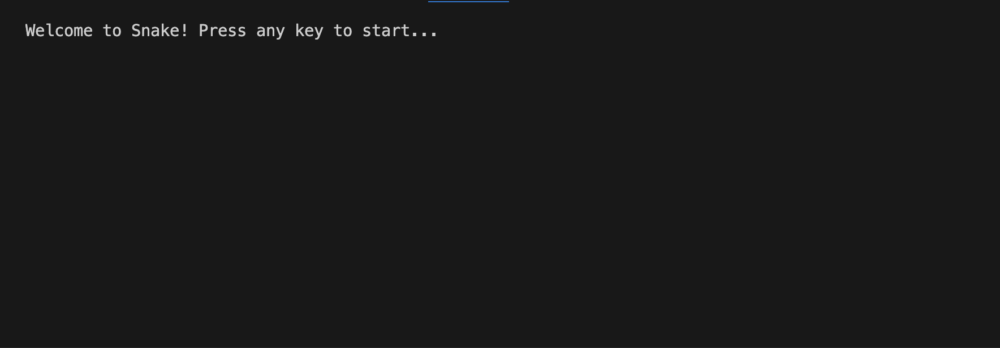
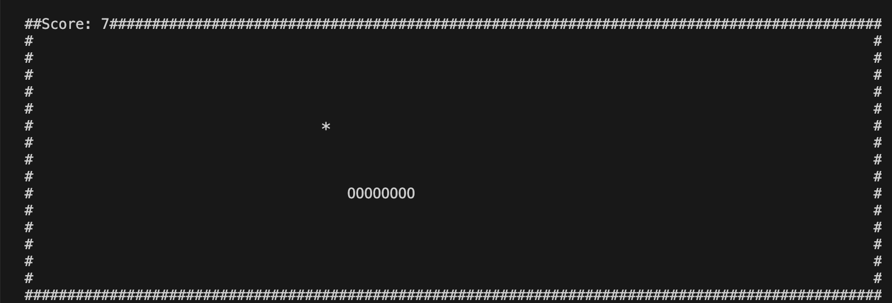
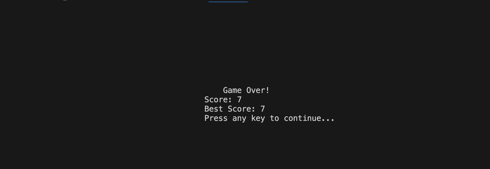

# Snake Game

A terminal-based Snake game implemented in C using the `ncurses` library.

---

## Features
- Dynamic gameplay with increasing speed as the snake grows.
- Keeps track of the best score.
- Simple and intuitive menu system for replay or exiting.
- Designed for terminal environments using the `ncurses` library.

---

## Screenshots
### Welcome Screen


### Gameplay


### Game Over Screen


---

## How to Build and Run
1. **Clone the Repository**:
   ```bash
   git clone https://github.com/s1upee/snake.git
   cd snake
   ```

2. **Build the Project**:
   ```bash
   make
   ```

3. **Run the Game**:
   ```bash
   ./snake
   ```

4. **Clean the Build**:
   ```bash
   make clean
   ```

## Controls
- **Arrow Keys**: Move the snake.
- **Q**: Quit the game.
- **Enter**: Select menu options.

## Folder Structure

```plaintext
snake/
├── src/                 # Source code files
│   ├── main.c
│   ├── snake.c
│   ├── game.c
│   ├── utils.c
├── include/             # Header files
│   ├── snake.h
│   ├── game.h
│   ├── utils.h
├── screenshots/         # Screenshots for README (optional)
│   ├── screenshot_welcome.png
│   ├── screenshot_gameplay.png
│   ├── screenshot_gameover.png
├── build/               # Optional: Compiled object files or binary (add to .gitignore)
├── .gitignore           # Files and directories to exclude from Git
├── Makefile             # Build instructions
├── README.md            # Project documentation
├── LICENSE              # License for the project
```

## Requirements
- GCC or Clang
- `make`
- `ncurses` library

---

## License
This project is licensed under the MIT License. See the [LICENSE](LICENSE) file for details.

---

## Contributing
Pull requests are welcome. For major changes, please open an issue first to discuss what you would like to change.

## Author
Lisa Krasiuk